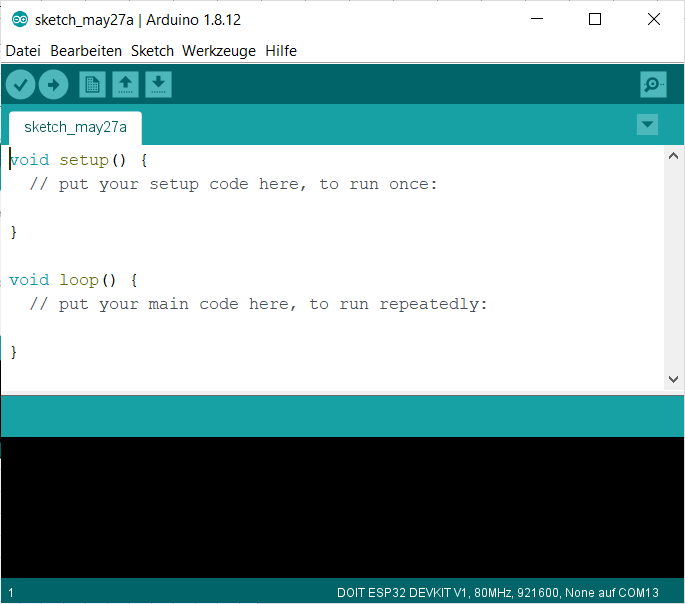
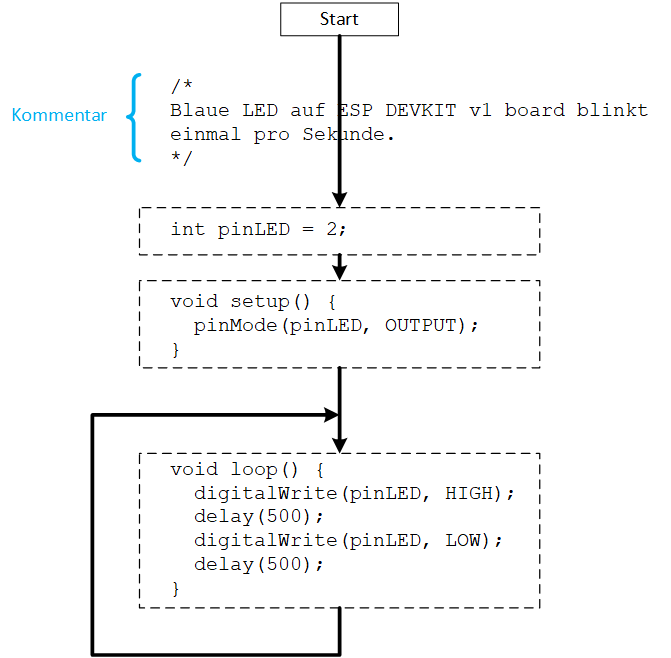
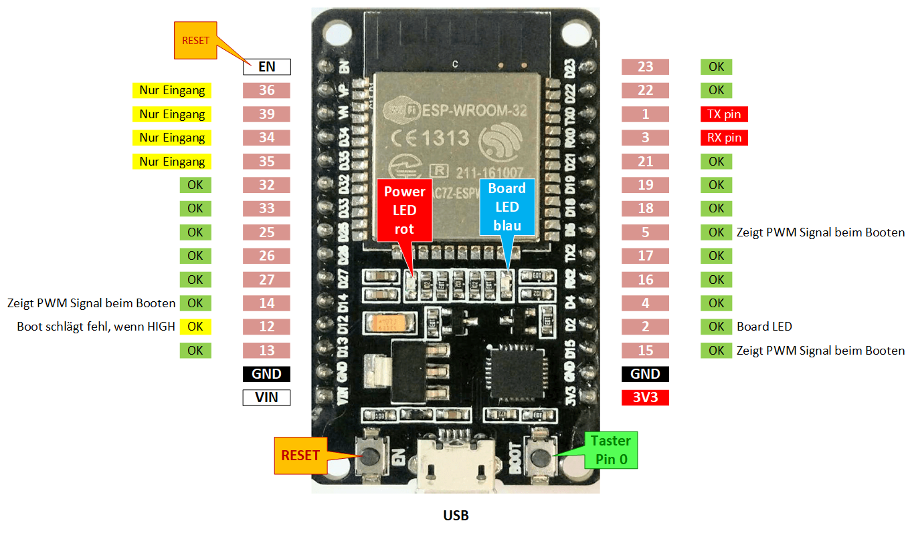

# Robotik und Programmieren

# Einleitung

Ziel:
- Ferienpassteilnehmer (5. - 7. Klasse) sollen ohne viel Ballast möglichst schnell mit Hilfe der Arduino Plattform ein Programm auf einen Mikrocontroller laden können.
- Danach können die Teilnehmer anhand einer funktionierende Umgebung in verschiedene Themen eintauchen: Programmieren, Mikrocontroller, Elektronik, 3D Modellierung etc.
- Wir verwenden das sehr günstigen und sehr leistungsfähige Board DOIT ESP32 DEVKIT V1 Board. Damit handeln wir uns ein paar Zusatzprobleme ein, die mit einem einfachen Board aus der Arduino Famili nicht hätten.


# In drei Schritten zum Tüftler

## 1. Einrichten
- **Arduino IDE** (Integrated Development Environment = Entwicklungsumgebung) **installieren**:
  - Installer unter https://www.arduino.cc/en/software herunterladen und ausführen.
- **ESP32 Board Informationen nachladen**:
  Arduino IDE > Werkzeuge > Board: ... > Boarverwalter: Suchen nach ESP, dann "... Espressif Systems ..." >  Installieren
- **Board in Arduino IDE auswählen**:
  - Arduino IDE > Werkzeuge > Board: "DOIT ESP32 DEVKIT V1"
- **Board mit USB Kabel and PC anschliessen**:
  - Achtung: Pins dürfen nicht mit Metall in Berührung kommen 
- **Port** wählen:
  - Arduino IDE > Werkzeuge > Port:
    - Port aus Liste auswählen. Nachdem der vorhergehend Schritt ausgeführt wurde sollte hier mindestens ein Eintrag "COM.." erscheinen, z.B. "COM15".
- **Ersten Sketch** aus Beispielen auswählen und **hochladen**:
  - Sketch: Arduino IDE > Datei > Beispiele > 01.Basics > Blink
  - (Alternativ: `boardLED.ino`, Dateiendung wird möglicherweise nicht angezeigt)
- Siehe auch z.B. [AFE]

## 2. Erste Gehversuche

- Wir legen unser erstes eigenes Programm an: Arduino IDE > Datei > Neu

  


- Untenstehenden Text kopieren
  ```
  /*
  Blaue LED auf ESP DEVKIT v1 board blinkt einmal pro Sekunde.
  */
  int pinLED = 2;

  void setup() {
    pinMode(pinLED, OUTPUT);
  }

  void loop() {
    digitalWrite(pinLED, HIGH);
    delay(500);
    digitalWrite(pinLED, LOW);
    delay(500);
  }
  ```
- Abspeichern: Arduino IDE > Datei > Speichern unter... > Dateiname: boardLED



## 3. Tüfteln



- Neuen Sketch anlegen: Arduino IDE > Datei > Neu

# Anhang
## Referenzen
[AFE] Arduino IDE installieren und fit machen für ESP8266 und ESP32, https://www.heise.de/ct/artikel/Arduino-IDE-installieren-und-fit-machen-fuer-ESP8266-und-ESP32-4130814.html


