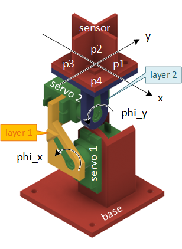
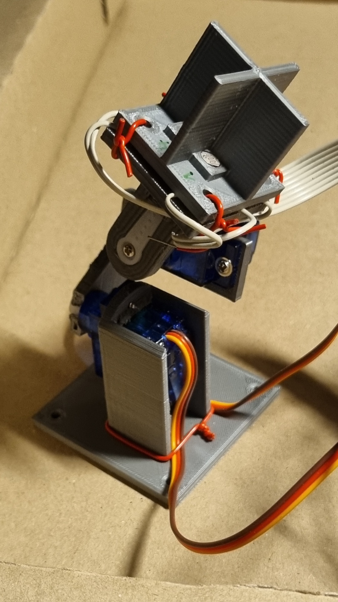
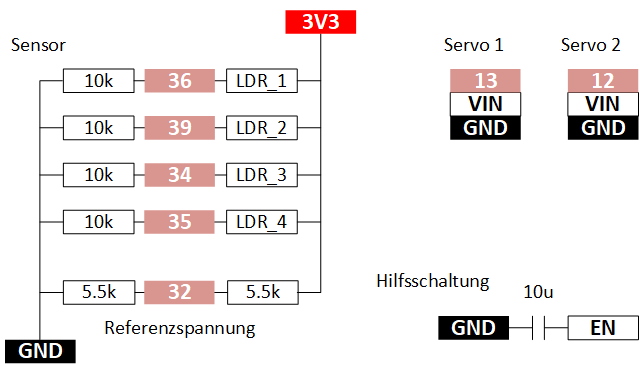

# Solar Tracker

Der Solar Tracker soll als Inspiration dienen.
Teile davon werden im Einführungskurs "Robotik für Tüftler" erklärt.

## Aufbau und Bezeichungen

- base     : Sockel mit Halterung für Servo 1
- layer 1  : Element, welches auf den Arm vom Servo 1 montiert wird
- layer 2  : Element, welches auf den Arm vom Servo 2 montiert wird
- sensor   : Element mit Lichtsensoren




Mit der Konstruktion mit zwei Servos, die je 180 Grad abdecken, kann alle Richtungen Senkrecht zu einen Halbkugel abdecken.

## 3D Modelle

Modelle im STL Format für den 3D Druck.

## Aufbau

Schaltschema für Anschluss an ESP32 DEVKIT V1:




## Algorithmus

Am 19.6.22 überarbeitet:
- Lichtsensoren anders auf layer 2 montiert -> Anpassung war nötig
- Funktioniert wieder.

- solar_tracker_v1.1

Sensor:
- Aufbau:
  - Fixer Widerstand gegen GND, Fotowiderstand (LDR, Light Dependent Resistor) gegen 3.3V, Abgriff dazwischen an AD Wandler
- Lichtmessung:
  - Photowiderstand wird kleiner bei mehr Licht
  - Mehr Licht resultiert in höherer Spannung am AD Wandler
  - Höhere Spannung am AD Wandler ergibt einen höheren AD AD Wandler Wert
  - Also: Mehr Licht ergit höheren AD Wandler Wert
- Vier Lichtmessungen kombinieren:
  ```
       y
    
       ^
       |
       |
     p2|p1
    ---+-----> x
     p3|p4
       |
  ```
  - Grössen:
    - p1, p2, p3, p4: Gemittelte AD Wandler Wert von den Fotosensoren LDR_1,2,3 und 4. Mittelung ist nötig, weil die AD Wandler Werte des ESP32 zufällige und starke Abweichungen aufweisen.

- Drehrichtung:
  - Servowinkel wird in Gegenuhrzeigersinn grösser (von oben gesehen).
  - Um in x Richtung bez. y Richtung zu drehen, muss Servowinkel verkleinert werden.

- Helligkeitsabweichung in x Richtung:
  - delta_x = (p1+p4) - (p2+p3):
  - Wenn Licht aus x Richtung (von rechts) kommt,
    - dann ist delta_x > 0
    - dann soll der Servo den Sensor in x Richtung drehen,
    - dann muss also der Winkel phi_x verkleinert werden.

- Helligkeitsabweichung in y Richtung:
  - delta_y = (p2+p1) - (p3+p4):
  - Wenn Licht aus y Richtung (von oben) kommt,
    - dann ist delta_y > 0
    - dann soll der Servo den Sensor in y Richtung drehen.
    - dann muss also der Winkel phi_y verkleinert werden.

Algorithmus:
- Bei jeder Iteration wird delta_x bestimmt. Liegt dieser Wert über einem Schwellwert, dann wird der Servo 1 um ein Grad in die Richtung bewegt, die delta_x verkleinert. Mit delta_y und Servo 2 wird gleich verfahren.

## Sketch

Version 1.3
- Verzeichnisstruktur:
  - solar_tracker_v1.3
    - solar_tracker_v1.3.ino
    - taskManager.h: Stellt zwei Klassen bereit, um zur Laufzeit aus mehreren (verpackten) Sketches wählen zu können.
- Funktionen:
  - Funktion wählen:
    - Umschalten mit dem Taster "BOOT" auf dem ESP32 DEVKIT V1 Board: Länger drücken und wieder loslassen.
    - Funktion wird mit Blinkcode der blauen LED angegeben.
  - Anzahl Blinkimpulse und zugehörige Funktion:
    - 1: Normalbetrieb: Aktiv nach dem Einschalten.
      - Tipp: Mit dem seriellen Plotter kann man die gemittelten AD Wandler Werte über die Zeit anzeigen lassen.
    - 2: Beide Servo drehen auf Mittelstellung (90 Grad) als Hilfe für den Zusammenbau.

    